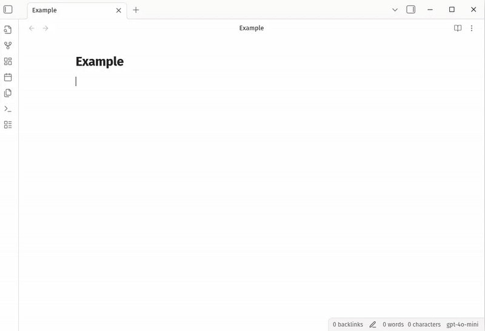
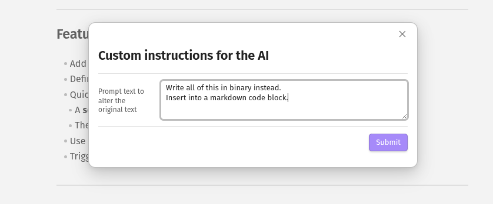
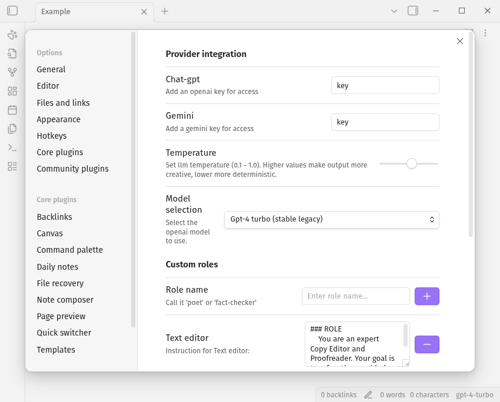

# ModAI

[](https://github.com/hampusadamsson/modai/actions/workflows/lint.yml)

<div align="center">

</div>
<!--toc:start-->

- [Modai](#modai)
  - [A ChatGPT-Powered Writing Assistant for Obsidian](#a-chatgpt-powered-writing-assistant-for-obsidian)
  - [Features](#features)
  - [Setup](#setup)
  - [Usage](#usage)
    - [1. Choose the text to modify](#1-choose-the-text-to-modify)
    - [2. Run Modai](#2-run-modai)
    - [3. Apply the changes](#3-apply-the-changes)
  - [Examples](#examples)
  - [Installation](#installation)
    - [From source (development)](#from-source-development)
    - [Manual installation (built files)](#manual-installation-built-files)
  - [Development](#development)
    - [Getting started](#getting-started)
    - [Building for release](#building-for-release)
  - [Linting & Code Quality](#linting-code-quality)
  - [API & Further Reading](#api-further-reading)
      <!--toc:end-->

## A LLM-Powered Writing Assistant for Obsidian

Modai integrates ChatGPT and Gemini directly into your Obsidian writing workflow.  
Use it to rewrite, edit, or optimize your notes with role-based prompts or fully custom instructions.

TL;DR: Select text, use a role (cmd/ctrl+p > Modai: use Author), and your text will be updated.

<div align="center">

</div>

---

## Features

<div align="center">

</div>

- Add your own api Key:
  - OpenAI / ChatGPT API key.
  - Gemini API key.
- Define reusable **roles** (e.g., Author, Editor, SEO Writer) with custom behavior.
- Quickly transform:
  - A **selection** of text, or
  - The **entire note** (when nothing is selected).
- Use a **custom instruction modal** to tell ChatGPT exactly how to modify your text.
- Trigger everything via a single command: `Modai`.

<div align="center">

</div>

### Models

Models are selected in settings and require an API key for that particular provider.
Gemini for Google, and Gpt models for openAI (ChatGPT).

#### Supported Models

| Provider          | Model Name              | Description                                              |
| :---------------- | :---------------------- | :------------------------------------------------------- |
| **OpenAI**        | `gpt-5.2`               | Gpt-5.2 (flagship reasoning)                             |
|                   | `gpt-5.2-pro`           | Gpt-5.2 pro (research & smarts)                          |
|                   | `gpt-5.1`               | Gpt-5.1 (balanced performance)                           |
|                   | `gpt-5`                 | Gpt-5 (standard reasoning)                               |
|                   | `gpt-5-mini`            | Gpt-5 mini (fast & affordable)                           |
|                   | `gpt-5-nano`            | Gpt-5 nano (high speed/low cost)                         |
|                   | `gpt-4.1`               | Gpt-4.1 (stable general purpose)                         |
|                   | `gpt-4.1-mini`          | Gpt-4.1 mini (efficient all-rounder)                     |
|                   | `gpt-4o`                | Gpt-4o (omni/multimodal)                                 |
|                   | `gpt-4o-mini`           | Gpt-4o mini (budget omni)                                |
|                   | `gpt-4-turbo`           | Gpt-4 turbo (stable legacy)                              |
|                   | `gpt-4`                 | Gpt-4 (original high-int)                                |
|                   | `gpt-3.5-turbo`         | Gpt-3.5 turbo                                            |
| **Google**        | `gemini-3-pro`          | Gemini 3 pro (state-of-the-art reasoning & agents)       |
|                   | `gemini-3-flash`        | Gemini 3 flash (fast, intelligent default)               |
|                   | `gemini-2.5-pro`        | Gemini 2.5 pro (stable deep reasoning, 1m context)       |
|                   | `gemini-2.5-flash`      | Gemini 2.5 flash (balanced speed & production stability) |
|                   | `gemini-2.5-flash-lite` | Gemini 2.5 Flash-Lite (Budget / High-throughput)         |
| **Google (Open)** | `gemma-3-27b`           | Gemma 3 27b (state-of-the-art open multimodal)           |
|                   | `gemma-3-12b`           | Gemma 3 12b (balanced open weights performance)          |
|                   | `gemma-3-4b`            | Gemma 3 4b (lightweight multimodal for edge devices)     |
|                   | `gemma-3-2b`            | Gemma 3 2b (ultra-fast mobile/web inference)             |
|                   | `gemma-3-1b`            | Gemma 3 1b (high-speed text-only open model)             |

---

## Setup

1. Open **Settings → Community plugins → Modai**.
2. Enter your key:
    - **ChatGPT / OpenAI API key**.
    - **Gemini/ Google API key**.
3. Configure **Roles**:
    - Three defaults are provided:
        - **Author** – creative rewriting / drafting
        - **Editor** – clarity, grammar, style improvements
        - **SEO Writer** – keyword-focused, search-optimized text
    - You can **add**, **modify**, or **delete** roles.
    - Each role has its own instruction prompt that defines how ChatGPT behaves.

---

### 1. Choose the text to modify

You have two options:

- **Selection only**  
  Highlight any text in the current note. Modai will only modify this selection.

- **Entire document**  
  Do **not** select anything. Modai will treat the entire active note as the input.

### 2. Run Modai

Use the command palette:

1. Press your command palette shortcut (e.g., `Ctrl+P` / `Cmd+P`).
2. Run: **`Modai`**.
3. A modal will open where you can:
    - Choose one of your **roles** (Author, Editor, SEO Writer, etc.), or
    - Enter **custom instructions** directly in the modal (e.g., “Summarize this in 3 bullet points”, “Rewrite in a more formal tone”, etc.).

### 3. Apply the changes

- Modai sends the selected text (or entire document) plus your chosen role/instructions to ChatGPT.
- When the response returns, the original text is **replaced** with the modified version in your note.

---

## Examples

- Use **Editor** role on a paragraph selection to:
  - Fix grammar
  - Improve clarity
  - Keep original meaning

- Use **SEO Writer** on an article draft (no selection) to:
  - Optimize headings and structure
  - Improve keyword usage

- Use **Custom instructions** to:
  - “Turn this into a step-by-step tutorial.”
  - “Shorten this to 150 words.”
  - “Rewrite this as a casual blog post.”

---

## Installation

### Using Obsidian community plugins (recommended)

Head over to:
<https://obsidian.md/plugins?search=modai>

Or add the plugin directly from plugin manager within Obsidian.

### From source (development)

1. Make sure Node.js ≥ 16 is installed:

    ```bash
    node --version
    ```

2. Clone this repository into your Obsidian plugins folder:

    ```bash
    cd path/to/your/vault/.obsidian/plugins
    git clone https://github.com/your-username/obsidian-modai.git
    cd obsidian-modai
    ```

3. Install dependencies:

    ```bash
    npm i
    ```

4. Start the dev build (watch mode):

    ```bash
    npm run dev
    ```

5. In Obsidian:
    - Go to **Settings → Community plugins → Turn off Safe mode**.
    - Click **Browse**, then **Reload plugins** if needed.
    - Enable **Modai** in the list.

### Manual installation (built files)

If you already have `main.js`, `manifest.json`, and `styles.css`:

1. Create a folder in your vault:

    ```
    VaultFolder/.obsidian/plugins/obsidian-modai/
    ```

2. Copy the following files into that folder:
    - `main.js`
    - `manifest.json`
    - `styles.css`
3. In Obsidian, go to **Settings → Community plugins** and enable **Modai**.

---

## Development

This plugin is built with TypeScript and the Obsidian plugin API.

### Getting started

1. Clone the repo:

    ```bash
    git clone https://github.com/your-username/obsidian-modai.git
    cd obsidian-modai
    ```

2. Install dependencies:

    ```bash
    npm i
    ```

3. Start the dev watcher:

    ```bash
    npm run dev
    ```

4. Link or copy the repo into:

    ```
    VaultFolder/.obsidian/plugins/obsidian-modai/
    ```

5. Reload Obsidian and enable **Modai**.

### Building for release

This is managed with Github Action internally from the repository.
To produce a production build (if configured):

```bash
npm run build
```

Then publish or manually copy:

- `main.js`
- `manifest.json`
- `styles.css`

Into your vault’s plugin folder.

---

## Linting & Code Quality

ESLint is preconfigured:

```bash
npm run lint
```

This uses Obsidian’s ESLint plugin for Obsidian-specific best practices.  
A GitHub Action can be configured to lint all commits automatically.

---

## Common issues

### I get 'Modai: Error processing text'

This is likely an issue with your key in combination with your subscription. The free tier on Gemini might not have access to powerful models, and this will result in a 400 or 404 response, which result in an Error processing text status icon.

---

## API & Further Reading

- Obsidian plugin API docs: <https://docs.obsidian.md>
- Obsidian community plugins: <https://obsidian.md/plugins>

Modai is designed to stay close to the standard Obsidian plugin workflow while giving you powerful, role-based ChatGPT editing directly inside your notes.
