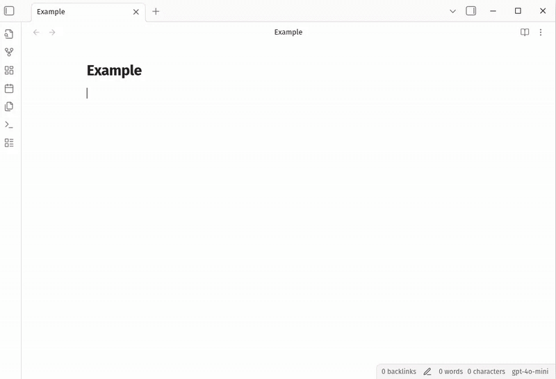
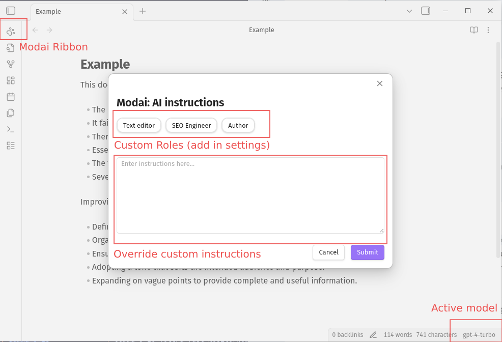
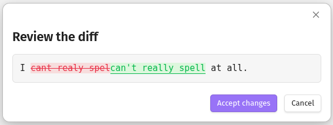
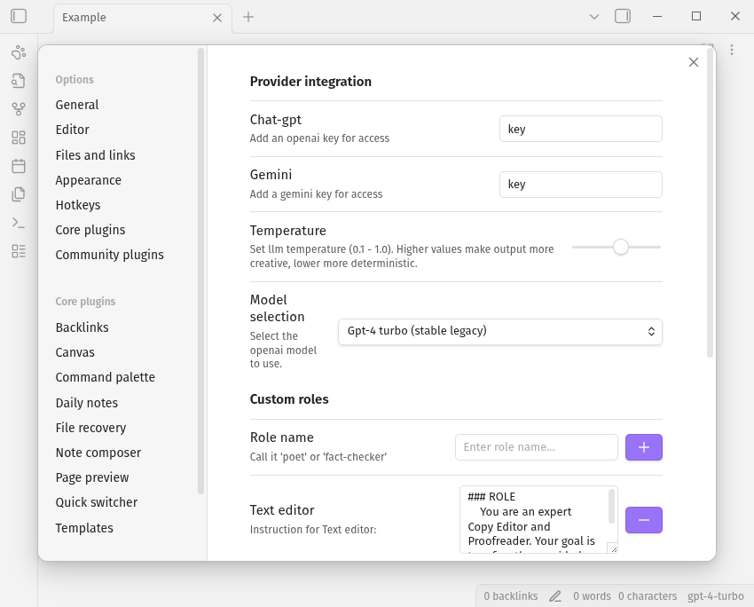

# ModAI

[](https://github.com/hampusadamsson/modai/actions/workflows/lint.yml) [](https://github.com/hampusadamsson/modai/actions/workflows/dependabot/dependabot-updates)

<div align="center">

</div>

<!--toc:start-->
- [ModAI](#modai)
  - [A LLM-Powered Writing Assistant for Obsidian](#a-llm-powered-writing-assistant-for-obsidian)
    - [Privacy](#privacy)
  - [Features](#features)
    - [Custom instructions](#custom-instructions)
    - [Diff view](#diff-view)
    - [Settings](#settings)
    - [Models](#models)
  - [Setup](#setup)
    - [1. Choose the text to modify](#1-choose-the-text-to-modify)
    - [2. Run Modai](#2-run-modai)
      - [1. Run a custom instruction](#1-run-a-custom-instruction)
      - [2. Run a role](#2-run-a-role)
    - [3. Apply the changes](#3-apply-the-changes)
  - [Examples](#examples)
  - [Custom Roles](#custom-roles)
    - [Text Editor](#text-editor)
  - [Workshop](#workshop)
    - [Keys](#keys)
    - [Documents and revisions](#documents-and-revisions)
  - [Installation](#installation)
    - [Using Obsidian community plugins (recommended)](#using-obsidian-community-plugins-recommended)
    - [From source (development)](#from-source-development)
    - [Manual installation (built files)](#manual-installation-built-files)
  - [Development](#development)
    - [Getting started](#getting-started)
    - [Tests](#tests)
    - [Building for release](#building-for-release)
  - [Linting & Code Quality](#linting-code-quality)
  - [Common issues](#common-issues)
    - [I get 'Modai: Error processing text'](#i-get-modai-error-processing-text)
  - [Roadmap](#roadmap)
    - [New Providers](#new-providers)
  - [API & Further Reading](#api-further-reading)
<!--toc:end-->

## A LLM-Powered Writing Assistant for Obsidian

Modai integrates ChatGPT and Gemini directly into your Obsidian writing workflow.  
Use it to rewrite, edit, or optimize your notes with role-based prompts or fully custom instructions.

TL;DR: Select text, use a role (cmd/ctrl+p > Modai: use Author), then review what it found one item at a time and apply what you agree with.

<div align="center">

</div>

### Privacy

Privacy first: only sends data to the LLM when you activate the Modai command to use a role or a custom instruction.
No background data access. No unwanted API calls.
Only the selected text or the active document is sent as context to the specified model.  

---

## Features

- Add your own api Key:
  - OpenAI / ChatGPT API key.
  - Gemini API key.
- Define reusable **roles** (e.g., Author, Editor, SEO Writer) with custom behavior.
- Quickly transform:
  - A **selection** of text, or
  - The **entire note** (when nothing is selected).
- Use a **custom instruction modal** to tell ChatGPT exactly how to modify your text.
- Trigger everything via a single command: `Modai`.

<div align="center">

</div>

### Custom instructions

Use instructions (or roles) to modify the entire document or just the selection.

### Diff view

Modai has diff (jdiff) wordsDiff highlighting any changes git style.

<div align="center">

</div>

### Settings

Pick the **Provider** (OpenAI, Gemini or Llama), the **Model**, and the
**Roles folder** that holds your role files here. Roles are then available from
the command palette (cmd/ctrl+p) and in the custom instructions modal.

<div align="center">

</div>

### Models

One token is enough. Pick the **Provider**, paste its **API key**, then pick the
**Model**: Modai asks the provider which models it offers and lists them. Every
provider also has a default endpoint, and **Base URL** overrides it when you
proxy or self-host the service.

- The list is read from the provider (`GET /models`) when the settings appear,
  and **Refresh models** reads it again.
- **Custom model...** takes any model ID, so a provider that does not list them
  (or one you reach through a proxy) still works.
- When the list cannot be read — no token yet, no such endpoint, offline — the
  setting says why and the text field is where you name the model.
- Nothing about the models is baked into the plugin, so a model that ships
  tomorrow works today.

| Provider | Default endpoint |
| :--- | :--- |
| OpenAI | `https://api.openai.com/v1` |
| Anthropic | `https://api.anthropic.com/v1` |
| Google Gemini | `https://generativelanguage.googleapis.com/v1beta` |
| OpenCode Zen | `https://opencode.ai/zen/v1` |
| OpenCode Go | `https://opencode.ai/zen/go/v1` |
| OpenRouter | `https://openrouter.ai/api/v1` |
| Vercel AI Gateway | `https://ai-gateway.vercel.sh/v1` |
| Hugging Face | `https://router.huggingface.co/v1` |
| Poe | `https://api.poe.com/v1` |
| Nano-GPT | `https://nano-gpt.com/api/v1` |
| Pollinations | `https://text.pollinations.ai/openai` |
| Chutes | `https://llm.chutes.ai/v1` |
| Novita AI | `https://api.novita.ai/v3/openai` |
| Mistral | `https://api.mistral.ai/v1` |
| Groq | `https://api.groq.com/openai/v1` |
| DeepSeek | `https://api.deepseek.com/v1` |
| xAI (Grok) | `https://api.x.ai/v1` |
| Together AI | `https://api.together.xyz/v1` |
| Fireworks AI | `https://api.fireworks.ai/inference/v1` |
| Perplexity | `https://api.perplexity.ai` |
| Cerebras | `https://api.cerebras.ai/v1` |
| SambaNova | `https://api.sambanova.ai/v1` |
| NVIDIA NIM | `https://integrate.api.nvidia.com/v1` |
| DeepInfra | `https://api.deepinfra.com/v1/openai` |
| Hyperbolic | `https://api.hyperbolic.xyz/v1` |
| Nebius | `https://api.studio.nebius.ai/v1` |
| FriendliAI | `https://api.friendli.ai/serverless/v1` |
| Upstage | `https://api.upstage.ai/v1` |
| AI21 | `https://api.ai21.com/studio/v1` |
| Cohere | `https://api.cohere.ai/compatibility/v1` |
| Nous Research | `https://inference-api.nousresearch.com/v1` |
| Moonshot (Kimi) | `https://api.moonshot.ai/v1` |
| Z.ai (GLM) | `https://api.z.ai/api/paas/v4` |
| Zhipu (BigModel) | `https://open.bigmodel.cn/api/paas/v4` |
| Alibaba Qwen (DashScope) | `https://dashscope.aliyuncs.com/compatible-mode/v1` |
| MiniMax | `https://api.minimax.io/v1` |
| SiliconFlow | `https://api.siliconflow.cn/v1` |
| PPIO | `https://api.ppinfra.com/v3/openai` |
| StepFun | `https://api.stepfun.com/v1` |
| Baichuan | `https://api.baichuan-ai.com/v1` |
| Ollama (local) | `http://localhost:11434/v1` |
| Ollama Cloud | `https://ollama.com/v1` |
| LM Studio (local) | `http://localhost:1234/v1` |
| llama.cpp (local) | `http://localhost:8080/v1` |
| vLLM (local) | `http://localhost:8000/v1` |
| LocalAI (local) | `http://localhost:8080/v1` |
| Jan (local) | `http://localhost:1337/v1` |
| KoboldCpp (local) | `http://localhost:5001/v1` |
| Text generation webui (local) | `http://localhost:5000/v1` |
| Custom endpoint (OpenAI compatible) | `(set your own)` |

Providers marked *(local)* do not need a token. **Custom endpoint** needs a base
URL of its own.

--- | :--- | :--- |
| OpenAI | `https://api.openai.com/v1` | 13 |
| Anthropic | `https://api.anthropic.com/v1` | 3 |
| Google Gemini | `https://generativelanguage.googleapis.com/v1beta` | 5 |
| OpenCode Zen | `https://opencode.ai/zen/v1` | 7 |
| OpenCode Go | `https://opencode.ai/zen/go/v1` | — |
| OpenRouter | `https://openrouter.ai/api/v1` | — |
| Vercel AI Gateway | `https://ai-gateway.vercel.sh/v1` | — |
| Hugging Face | `https://router.huggingface.co/v1` | — |
| Poe | `https://api.poe.com/v1` | — |
| Nano-GPT | `https://nano-gpt.com/api/v1` | — |
| Pollinations | `https://text.pollinations.ai/openai` | — |
| Chutes | `https://llm.chutes.ai/v1` | — |
| Novita AI | `https://api.novita.ai/v3/openai` | — |
| Mistral | `https://api.mistral.ai/v1` | — |
| Groq | `https://api.groq.com/openai/v1` | — |
| DeepSeek | `https://api.deepseek.com/v1` | — |
| xAI (Grok) | `https://api.x.ai/v1` | — |
| Together AI | `https://api.together.xyz/v1` | — |
| Fireworks AI | `https://api.fireworks.ai/inference/v1` | — |
| Perplexity | `https://api.perplexity.ai` | — |
| Cerebras | `https://api.cerebras.ai/v1` | — |
| SambaNova | `https://api.sambanova.ai/v1` | — |
| NVIDIA NIM | `https://integrate.api.nvidia.com/v1` | — |
| DeepInfra | `https://api.deepinfra.com/v1/openai` | — |
| Hyperbolic | `https://api.hyperbolic.xyz/v1` | — |
| Nebius | `https://api.studio.nebius.ai/v1` | — |
| FriendliAI | `https://api.friendli.ai/serverless/v1` | — |
| Upstage | `https://api.upstage.ai/v1` | — |
| AI21 | `https://api.ai21.com/studio/v1` | — |
| Cohere | `https://api.cohere.ai/compatibility/v1` | — |
| Nous Research | `https://inference-api.nousresearch.com/v1` | — |
| Moonshot (Kimi) | `https://api.moonshot.ai/v1` | — |
| Z.ai (GLM) | `https://api.z.ai/api/paas/v4` | — |
| Zhipu (BigModel) | `https://open.bigmodel.cn/api/paas/v4` | — |
| Alibaba Qwen (DashScope) | `https://dashscope.aliyuncs.com/compatible-mode/v1` | — |
| MiniMax | `https://api.minimax.io/v1` | — |
| SiliconFlow | `https://api.siliconflow.cn/v1` | — |
| PPIO | `https://api.ppinfra.com/v3/openai` | — |
| StepFun | `https://api.stepfun.com/v1` | — |
| Baichuan | `https://api.baichuan-ai.com/v1` | — |
| Ollama (local) | `http://localhost:11434/v1` | 5 |
| Ollama Cloud | `https://ollama.com/v1` | — |
| LM Studio (local) | `http://localhost:1234/v1` | — |
| llama.cpp (local) | `http://localhost:8080/v1` | — |
| vLLM (local) | `http://localhost:8000/v1` | — |
| LocalAI (local) | `http://localhost:8080/v1` | — |
| Jan (local) | `http://localhost:1337/v1` | — |
| KoboldCpp (local) | `http://localhost:5001/v1` | — |
| Text generation webui (local) | `http://localhost:5000/v1` | — |
| Custom endpoint (OpenAI compatible) | `(set your own)` | — |

Providers marked *(local)* do not need a token.

--------- | :---------------------- | :------------------------------------------------------- |
| **OpenAI** | `gpt-5.2`               | GPT-5.2 (flagship reasoning)                             |
|            | `gpt-5.2-pro`           | GPT-5.2 pro (research & smarts)                          |
|            | `gpt-5.1`               | GPT-5.1 (balanced performance)                           |
|            | `gpt-5`                 | GPT-5 (standard reasoning)                               |
|            | `gpt-5-mini`            | GPT-5 mini (fast & affordable)                           |
|            | `gpt-5-nano`            | GPT-5 nano (high speed/low cost)                         |
|            | `gpt-4.1`               | GPT-4.1 (stable general purpose)                         |
|            | `gpt-4.1-mini`          | GPT-4.1 mini (efficient all-rounder)                     |
|            | `gpt-4o`                | GPT-4o (omni/multimodal)                                 |
|            | `gpt-4o-mini`           | GPT-4o mini (budget omni)                                |
|            | `gpt-4-turbo`           | GPT-4 turbo (stable legacy)                              |
|            | `gpt-4`                 | GPT-4 (original high-int)                                |
|            | `gpt-3.5-turbo`         | GPT-3.5 turbo                                            |
| **Gemini** | `gemini-3-pro`          | Gemini 3 pro (state-of-the-art reasoning & agents)       |
|            | `gemini-3-flash`        | Gemini 3 flash (fast, intelligent default)               |
|            | `gemini-2.5-pro`        | Gemini 2.5 pro (stable deep reasoning, 1m context)       |
|            | `gemini-2.5-flash`      | Gemini 2.5 flash (balanced speed & production stability) |
|            | `gemini-2.5-flash-lite` | Gemini 2.5 flash-lite (budget / high-throughput)         |
| **Llama**  | `llama3.1:8b`           | Llama 3.1 8b (local deployment)                          |
|            | `llama-3-70b`           | Llama 3 70b (local deployment, high performance)         |
|            | `llama-2-70b`           | Llama 2 70b (local deployment, widely supported)         |
|            | `llama-2-13b`           | Llama 2 13b (local deployment, balanced size)            |
|            | `llama-2-7b`            | Llama 2 7b (local deployment, lightweight)               |

---

## Setup

1. Open **Settings → Community plugins → Modai**.
2. Pick a **Provider** — first party APIs, gateways, cloud inference hosts and
   local servers (see [Models](#models)). Each one has a default endpoint;
   **Base URL** overrides it if you need to.
3. Paste your **API key** for that provider into the single token field. Local
   servers can leave it empty.
4. Pick a **Roles folder** holding one markdown file per role, see
   [Custom Roles](#custom-roles).

---

### 1. Choose the text to modify

You have two options:

- **Selection only**  
  Highlight any text in the current note. Modai will only modify this selection.

- **Entire document**  
  Do **not** select anything. Modai will treat the entire active note as the input.

### 2. Run Modai

#### 1. Run a custom instruction

Use the command palette:

1. Use the ribbon (paw) or press your command palette shortcut (e.g., `Ctrl+P` / `Cmd+P`).
2. Run: **`Modai: Custom Instructions`**.
3. A modal will open where you can:
    - Choose one of your **roles** (Author, Editor, SEO Writer, Strategic Consultant, etc.), or
    - Enter **custom instructions** directly in the modal (e.g., “Summarize this in 3 bullet points”, “Rewrite in a more formal tone”, etc.).

#### 2. Run a role

1. Press your command palette shortcut (e.g., `Ctrl+P` / `Cmd+P`).
2. Run: **`Modai: use <role>`**, one command per role file in your roles folder.

### 3. Apply the changes

- Modai now supports both asking and replacing using the Modai plugin.
- Hotkeys for custom modal have been added (r for replace and a for ask) with ctrl/cmd+a/r.

---

## Examples

- Use **Editor** role on a paragraph selection to:
  - Fix grammar
  - Improve clarity
  - Keep original meaning

- Use **SEO Writer** on an article draft (no selection) to:
  - Optimize headings and structure
  - Improve keyword usage

- Use **Custom instructions** to:
  - “Turn this into a step-by-step tutorial.”
  - “Shorten this to 150 words.”
  - “Rewrite this as a casual blog post.”

---

## Custom Roles

Roles are markdown files in a vault folder, so they can be written, edited and
git-tracked like any other note. The file name is the role name, the file
content the instructions.

1. Create a folder for the role files, for example `Modai roles`:

    ```
    Modai roles/
      Author.md
      Text editor.md
      fact-checker.md
    ```

2. Pick that folder in **Settings → Modai → Roles folder** — type the path or
   use **Browse**. The settings show the roles that were found, and every role
   gets its own command (`Modai: use Author`).

Good to know:

- Subfolders are read as well, and the first file wins if two roles share a
  name.
- A leading YAML frontmatter block is ignored, so role files can carry tags or
  descriptions.
- Files without content are skipped.
- Adding, renaming or deleting a role file updates the command palette right
  away.

### Text Editor

An example role file, `Text editor.md`:

```markdown
### ROLE
You are an expert Copy Editor and Proofreader. Your goal is to refine the provided text into a clear, polished, and professional version while strictly maintaining the original intent, tone, and factual content.

### INSTRUCTIONS
1.  **Correct:** Fix all errors in spelling, grammar, punctuation, and syntax. Ensure consistency in style (e.g., capitalization and serial commas).
2.  **Refine Flow:** Improve transitions and sentence structure to enhance readability. Vary sentence length to create a natural, engaging rhythm.
3.  **Conciseness:** Eliminate filler words and redundant phrases without removing core ideas or altering the author's unique voice.
4.  **Preservation:** Do not add external information or modify the underlying meaning. Maintain the original factual integrity throughout.
5.  **Stealth Execution:** Do not explicitly reference your role, these instructions, or the edits made. Do not include any introductory remarks, explanations, or "meta-talk."
6.  **Formatting Constraint:** Do **not** remove or modify any images, tables, code blocks, or existing markdown formatting.

### OUTPUT FORMAT
Provide the improved text only. Nothing else.
```

---

## Workshop

Modai works on notes as a workshop: run a role and what it finds lands in the
**Modai workshop** sidebar, each review item anchored to the text it talks about,
the way Genius annotations work.

1. Open the panel with **Modai: Open workshop panel** — or just run a role, which
   opens it for you.
2. Run a role from the command palette, for example **Modai: use Author**.
3. The panel hands you **one review item at a time**: the current one is the
   only expanded card, with the text it points at, its diff and the reviewer's
   comment, and it is the bright highlight in the note. Everything still waiting
   sits behind it in **Up next**, dimmed in the text, so you always know which
   passage the current item is about. Notes that do not rewrite anything show
   the passage they point at instead of a diff.
4. Decide with **Apply current review item** or **Reject current review item**
   (or the buttons on the card) and the next one comes up on its own, in
   document order, wrapping at the end. **Next review item** and **Previous
   review item** move through the queue without deciding yet, and clicking a row
   in **Up next** jumps straight to it.
5. The pass is **chunked**: a role returns a few items at a time (set with
   **Review items per pass**), the model is told what has already come up, and
   when the queue is empty **Get the next chunk** asks for the rest.

A pass either rewrites text or reviews it, decided by the role file. The mode
lives in its frontmatter:

```markdown
---
mode: review
---

### ROLE
You are a ruthless developmental editor.
```

- `mode: edit` (the default) — the role rewrites the text, so every item carries
  a replacement you can apply.
- `mode: review` — the role comments on the text. A replacement is optional, so
  an item can be purely a remark, or a remark plus a rewrite you can apply.
  (`mode: feedback` is still read as `review`.)

Both modes produce the same sidebar cards, and both point at a passage of the
note, so applying and rejecting works the same way for either.

**Use custom instructions** lands in the same panel, and everything it produces
points at text:

- **Replace** turns the model's rewrite into review items (split into hunks when
  the whole note is rewritten), so they can be applied one by one.
- **Review** turns its answer into a note anchored to the selection, or to the
  first line of the note when nothing is selected, so commentary is attached to
  the passage it is about.

### Keys

The panel is built for the keyboard — click it once (or use **Modai: Open
workshop panel**, which focuses it) and these keys work, vim style:

| Key | Action |
| :--- | :--- |
| `j` / `k` (or `↓` / `↑`) | next / previous review item |
| `g` / `G` | first / last review item |
| `a` | apply the selected review item |
| `r` | reject it |
| `m` | flag / unflag it as a major revision |
| `o` | open it in the editor and put the cursor there |
| `[` / `]` | previous / next document |
| `x` | clear applied and rejected items |
| `?` | key map (on screen) |
| `Esc` | dismiss the key map |

Every one of these also exists as a command, so they can be bound to hotkeys:
**Next review item**, **Previous review item**, **Apply current review item**,
**Reject current review item**, **Get next review chunk** and **Open workshop
panel**. Modai ships no
default hotkeys on purpose — they are yours to pick, and the panel keeps its own
keys out of the way of any modifier combination.

The panel shows a status line at the bottom (`MODAI`, the document, and the item
you are on) and each button carries its key, so the bindings are
visible while you work.

### Documents and revisions

- **Documents** lists every note with review items and how many are still
  pending; click one to open it.
- **Revisions** records every applied item with the text before and after.
  Hit **Flag major** on the ones that matter, so structural passes stay findable.
- **Clear done** drops the applied and rejected entries of the open document.
- Review items live with the plugin settings in `data.json`; the newest 500
  items and 300 revisions are kept, and the panel remembers which role produced
  the last pass on a note so the next chunk can continue it.
- When the quoted text is edited away, the card is marked **text changed** and
  applying it says so instead of changing the wrong spot.

---

## Installation

### Using Obsidian community plugins (recommended)

Head over to:
<https://obsidian.md/plugins?search=modai>

Or add the plugin directly from plugin manager within Obsidian.

### From source (development)

1. Make sure Node.js ≥ 16 is installed:

    ```bash
    node --version
    ```

2. Clone this repository into your Obsidian plugins folder:

    ```bash
    cd path/to/your/vault/.obsidian/plugins
    git clone https://github.com/your-username/obsidian-modai.git
    cd obsidian-modai
    ```

3. Install dependencies:

    ```bash
    npm i
    ```

4. Start the dev build (watch mode):

    ```bash
    npm run dev
    ```

5. In Obsidian:
    - Go to **Settings → Community plugins → Turn off Safe mode**.
    - Click **Browse**, then **Reload plugins** if needed.
    - Enable **Modai** in the list.

### Manual installation (built files)

If you already have `main.js`, `manifest.json`, and `styles.css`:

1. Create a folder in your vault:

    ```
    VaultFolder/.obsidian/plugins/obsidian-modai/
    ```

2. Copy the following files into that folder:
    - `main.js`
    - `manifest.json`
    - `styles.css`
3. In Obsidian, go to **Settings → Community plugins** and enable **Modai**.

---

## Development

This plugin is built with TypeScript and the Obsidian plugin API.

### Getting started

1. Clone the repo:

    ```bash
    git clone https://github.com/your-username/obsidian-modai.git
    cd obsidian-modai
    ```

2. Install dependencies:

    ```bash
    npm i
    ```

3. Start the dev watcher:

    ```bash
    npm run dev
    ```

4. Link or copy the repo into:

    ```
    VaultFolder/.obsidian/plugins/obsidian-modai/
    ```

5. Reload Obsidian and enable **Modai**.

### Tests

Unit tests run with [Vitest](https://vitest.dev) and cover the provider
integrations, model routing and settings defaults. The `obsidian` runtime
module is mocked, so no vault, network access or API keys are needed:

```bash
npm test          # single run
npm run test:watch
```

### Building for release

Releases are automated with [release-please](https://github.com/googleapis/release-please):
commits to `master` follow [Conventional Commits](https://www.conventionalcommits.org),
release-please keeps a release PR open with the next version and `CHANGELOG.md`,
and merging that PR creates the tag and release. `versions.json` and
`manifest.json` are kept in sync by `version-bump.mjs`, and the workflow builds
`main.js`, `manifest.json` and `styles.css`, signs them with a GitHub artifact
attestation, and attaches them to the release.

To produce the same production build locally:

```bash
npm run build
```

Then copy or publish:

- `main.js`
- `manifest.json`
- `styles.css`

Into your vault’s plugin folder.

---

## Linting & Code Quality

ESLint is preconfigured:

```bash
npm run lint
```

This uses Obsidian’s ESLint plugin for Obsidian-specific best practices.
`npm run check-all` runs lint, formatting, dead-code analysis (Knip) and the
test suite, and the GitHub Action runs the type check, lint, tests and the
plugin build on every push and pull request.

---

## Common issues

### I get 'Modai: Error processing text'

This is likely an issue with your key in combination with your subscription. The free tier on Gemini might not have access to powerful models, and this will result in a 400 or 404 response, which result in an Error processing text status icon.

---

## Roadmap

This roadmap outlines the planned features and future direction for **ModAI**.

### New Providers

- [x] **Local Models** – Support for [Ollama](https://ollama.com/) to enable 100% private, local inference.
- [ ] **Anthropic** – Support for Claude 3.5 Sonnet and Opus models.
- [ ] **Mistral AI** – Native API support for Mistral and Mixtral.
- [ ] **Streaming Responses** – Watch the AI "type" live inside the Diff view for immediate feedback.
- [ ] **Side-by-Side Diff** – A split-pane comparison view for larger document rewrites.
- [ ] **Instruction History** – Quickly access your most frequent custom instructions.
- [ ] **Partial Acceptance** – Interactively select which specific AI changes to keep or discard.
- [ ] **Context Awareness** – Send surrounding text context to the AI to maintain tone and flow.
- [ ] **YAML Awareness** – Allow the AI to read and intelligently update note metadata/frontmatter.
- [ ] **Prompt Variables** – Support for dynamic placeholders like `{{title}}`, `{{date}}`, and `{{selection}}`.
- [ ] **Append as Callout** – Insert AI review items as Obsidian callouts (`> [!AI]`) for non-destructive editing.
- [ ] **Auto-Cleanup** – Toggleable filters to remove common LLM "chatter" or formatting artifacts.
- [x] **Mobile Optimization** – Full UI polish for the Obsidian mobile app on iOS and Android.

---

## API & Further Reading

- Obsidian plugin API docs: <https://docs.obsidian.md>
- Obsidian community plugins: <https://obsidian.md/plugins>

Modai is designed to stay close to the standard Obsidian plugin workflow while giving you powerful, role-based ChatGPT editing directly inside your notes.
